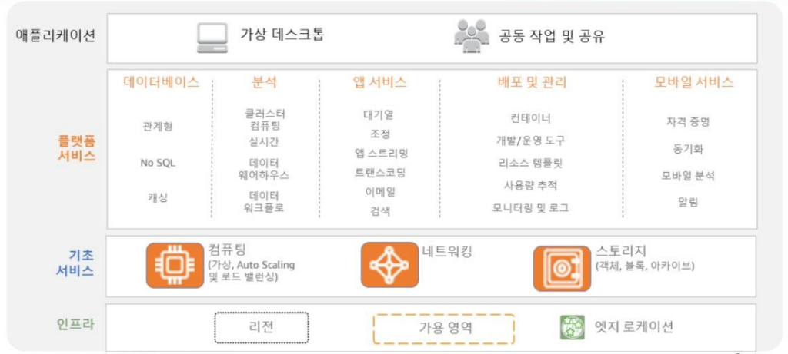
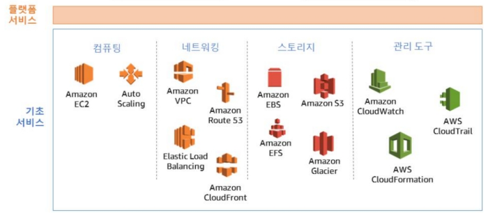

## AWS?

- 아마존닷컴에서 개발한 Cloud computing 플랫폼
- Amazon Web Services 는 아마존에서 제공하는 Cloud 서비스로, Networking을 기반으로 가상 컴퓨터와 스토리지, 네트워크 인프라 등 다양한 서비스를 제공

## 클라우드 컴퓨팅( Cloud computing) ?

- 기존의 물리적인 형태의 실물 컴퓨팅 리소스를 네트워크 기반 서비스 형태로 제공
- 사용자로 하여금 네트워크 상에서 클라우드 서비스의 자원을 사용
- 3가지 분류
    
    
    ### IaaS (Infrastructure as a Service)
    
    - AWS, 네이버플랫폼과 같은 인프라스트럭쳐를 제공하는 제공하는 서비스
    - 가상 서버 또는 스토리지, 가상 네트워크 등의 리소스를 서비스 형태로 제공
    - 클라우드 IT의 기본 구성 요소 (네트워킹, 컴퓨터, 데이터 스토리지 공간)
    
    ### PaaS (Platform as a Service)
    
    - 하드웨어/OS/미들웨어 에 대한 관리는 서비스 제공자가 하며, 사용자는 제공된 미들웨어만 사용
    - 주로 개발 환경과 관련한 서비스를 제공
    - 기본 인프라를 관리할 필요 없이 애플리케이션을 실행할 수 있게 해준다.
    
    ### SaaS (Software as a Service)
    
    - 소프트웨어 또는 애플리케이션의 기능만 제공
    - 네이버클라우드, 웹 메일, ERP 등과 같은 형태의 서비스 제공

 

## AWS 고객

- 엔터프라이즈 고객
    
    넷플릭스, SEGA, 아마존, Discovery, SAP, TOSHIBA 등
    
- 스타트업 고객
    
    smugMug, Spotify 등
    
- 공공 부문 고객
    
    NASA, CDC, 2U 등
    

## AWS 클라우드 컴퓨팅의 장점

- 저렴한 비용

확장형 글로벌 인프라를 구축 및 관리하고, 더 저렴한 요금의 형태로 사용자에게 비용 절감 혜택을 고스란히 돌려준다.

자본비용을 가변비용으로 대체하여 시간대별로도 자원을 끌 수 있음.

- 속도 및 민첩성 개선

데이터센터 운영 및 유지 관리에 비용 투자 불필요

몇 분 만에 전세계에 배포

언어 및 운영 체제에 구애 받지 않는 플랫폼이다. 따라서 사용자의 비즈니스에 가장 적합한 개발 플랫폼 또는 프로그래밍 모델을 선택할 수 있다.

- 민첩성, 즉각적 융퉁성

물리적인 서버를 구축하길 기다리는 대신 즉시 새로운 앱을 배포하고, 수요를 기준으로 축소할 수도 있다. 

- 몇 분 만에 전 세계에 배포 가능 등

## AWS 서비스 스택

## AWS 기초 서비스

- 컴퓨팅
    - Amazon Elastic Compute Cloud(EC2)는 AWS 컴퓨팅서비스의 핵심이다.
        
        EC2를 사용하면 새로운 서버 인스턴스 확보 , 시간 단축, 컴퓨팅 요구사항의 변화에 따라 신속하게 컴퓨팅파워를 확장하거나 축소할 수 있다.
        
        EC2 서비스를 Elastic Load Balancing 및 Auto Scaling 서비스와 결합하면 애플리케이션을 위한 고가용성및 고성능 인프라를 개발할 수 있다.
        
    
- 네트워킹
    - 네트워킹 서비스 그룹은 DNS 서비스를 제공하고, 사용자에게 AWS상의 가상 네트워킹 환경을 직접 제어할 수 있는 기능을 제공한다.
- 스토리지
    - AWS는 데이터 및 사용 유형에 따라 여러 스토리지 옵션을 제공한다.
- 관리 및 보안
    - AWS를 사용하면 AWS Identify and Access Management(IAM) 서비스를 통해 사용자 인증과 권한 부여기능을 관리할 수 있다.
- 애플리케이션
    - Amzon Workspaces와 같은 애플리케이션 서비스를 사용하면 클라우드 기반 데스크톱을 손쉽게 프로비저닝할 수 있으며, 사용자는  지원되는 모든 기기에서 필요한 문서, 애플리케이션 및 리소스에 액세스할 수 있다.

# 단어 정리

공공 부문 - 정부 조직 (이런 느낌)

가변비용 - 생산량에 따라 변하는 비용

프로비저닝 - 사용자의 요구에 맞게 시스템 자원을 할당, 배치, 배포해 두었다가 필요 시 시스템을 즉시 사용할 수 있는 상태로 미리 준비해 두는 것
