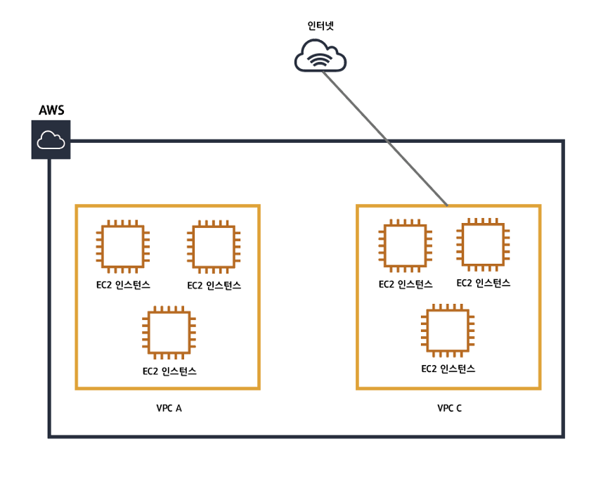

## VPN(Virtual Private Network)?

실제 사설망이 아닌 가상의 사설망입니다.

## VPC(Virtual Private Cloud)?

 사용자가 정의한 가상 네트워크이다

## VPC가 없는 구조

VPC가 없다면 시스템의 복잡도를 엄청나게 끌어올릴뿐만 아니라 하나의 인스턴스만 추가되도 모든 인스턴스를 수정해야하는 불편함이 생긴다.

## VPC가 적용한 구조

VPC를 적용하면 VPC별로 네트워크를 구성할 수 있고 각각 네트워크 설정을 줄 수 있다. 또한 각각의 VPC는 완전히 독립된 네트워크처럼 작동하게 된다
