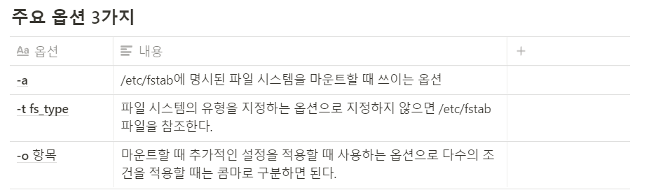
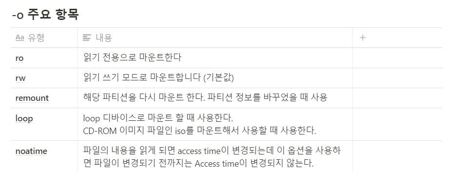
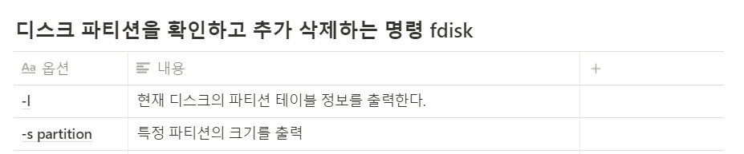

## Mount?

디스크와 같은 물리적인 장치를 특정 위치 즉 Directory에 연결 시켜주는 것을 Mount 라고 한다.

**PnP(Plug and play  = 디바이스를 꼽기만 하면 알아서 설정하고 플레이되는 ..) 라는 기능 덕분에 사용자가 직접 해줄 필요는 없다. 결국 다 내부에서 마운트 작업이 이뤄진다.** 

하지만!! 

리눅스의 경우 특히 서버 환경의 경우는 PnP 기능이 작동하지 않고 일일이 직접 우리가 연결을 해줘야 한다. 관리자가 직접 특징 디렉터리에 붙이는 작업을 수행해줘야 한다 → Mount 작업!!!

# Mount 명령어

사용법

# mount [option] [device] [directory]

# Disk Mount 해보기

## Disk 추가

**디스크를 추가 하기 위해서는 VMware 메인 화면으로 나가 disk를 추가 해야 한다 (이때 다시 시작하게 되면 운이 안 좋으면 새로 만든 disk가 시작하게 되어? 처음부터 다시 설정 해야 되는 불상사가 생긴다. 아직 해결 방법은 찾지 못했지만 그냥 처음부터 다시 하면 된다 ㅎㅎ;;** 

## 파티션 설정

사실 마운팅을 하기 전에 추가 하는 게 disk이기 때문에 하드디스크 영역인 파티셔닝 설정과 포맷 작업을 해줘야 한다.

fdisk를 통해서 디스크를 확인할 수도 있지만 파티션을 추가해줄 수도 있다.
