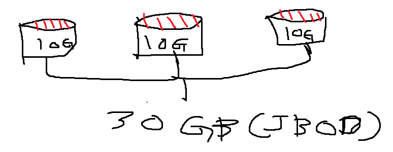
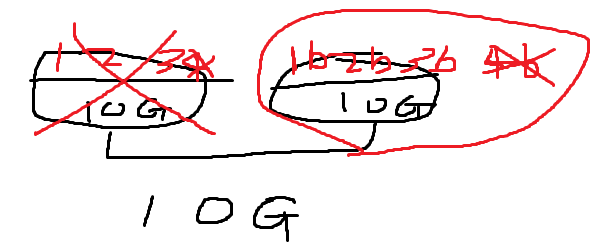
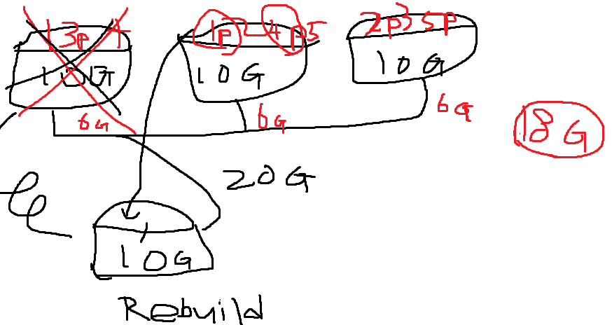
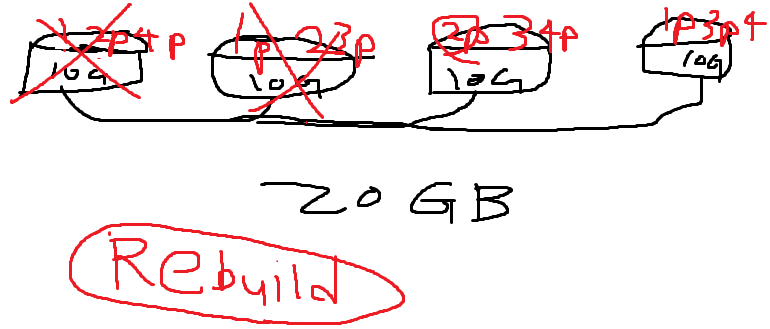

## Raid System?

여러 개의 물리적인 disk를 묶어서 한 개의 커다란 볼륨을 만드는 것

### Span Volume (JBOD)

### Raid 0

- 분산적으로 한다
- 속도가 엄청나게 많이 개선된다
- I/O 성능이 개선된다
- 영상 작업에 많이 사용된다

### Raid 1

- b = 백업
- 첫 번째 disk에서 삭제하면 백업본도 삭제
- 첫 번째 disk에 결함이 생겨도 두 번째 disk로 복구 할 수 있다.
- I/O 성능은 더 안 좋아진다. Because 백업본까지 만들기때문에
- disk 결함을 허용하는 시스템이다.

 

### Raid 5

          
- 1개 disk 결함을 허용하면서 데이터를 분산해서 저장 가능
- Rebuild를 하면 두 번째 disk로부터 정보를 받아와 처음과 같아진다

### Raid 6

- HOT Spare

10G disk를 만들어 논다. (HOT = 운영중) 만약 첫 번째 disk가 fail이 날 경우 HOT Spare가 그 자리를 채워준다. 

HOT Spare에 갯수 제한은 없지만 대부분 2개 이상을 단다.

- 2개 disk 결함 허용
- Rebuild 하는데 많은 시간 소요
